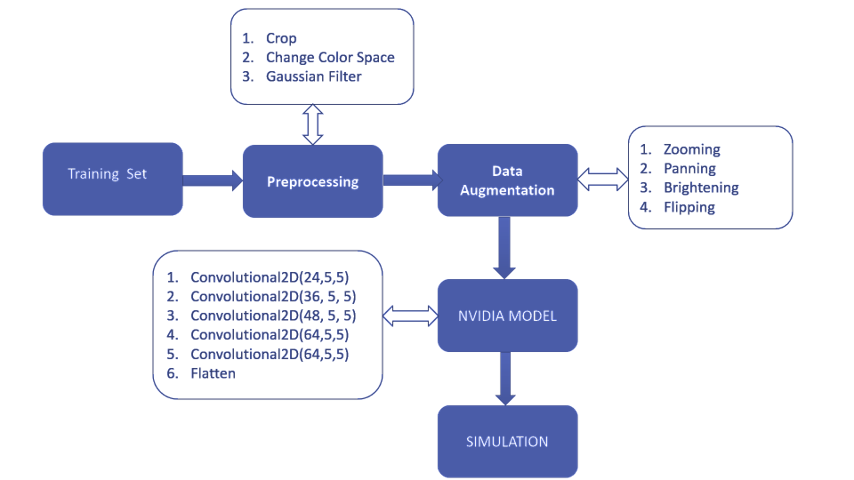

# Autonomous_Car_Model
This project aims to build the AI model to predict the factors such as steering angle, throttle in a real-time environment, thus reducing manual efforts to drive the car.

## How I built the model:
- I followed the behavioral cloning methodology where the machine gets enforced to study the human behavior to become capable that behavior to respond on their own in the real-time scenario.
- To follow this approach I used Convolutional Neural Network (CNN), where I passed images including front, left, and right view of the route and the steering angle, throttle(response of humans) as the inputs.
- The model is trained by applying layers of CNN and adjusting the factors such as kernel matrix, activation functions used by CNN.
- Achieved further accuracy by using the image processing techniques for captured images.
- Used the open-source simulator provided by Udacity for Testing and result determination.

## Get an insight:

## Future Scope:
- This project has a wide range of scope out of which some of the ideas include: 
- The feature recognizing obstacles such as humans, speed breaker, other vehicles and then predicting the corresponding behavior such as reducing the speed, using different route, etc. can be added.
- The feature of recognizing obstacles such as humans, speed breakers, other vehicles and prediction for corresponding behavior (reducing the speed, using different route, etc.) can be added.
- The function to recognize traffic signals or traffic signals and determine actions accordingly can be implemented.
- Networking which can connect the vehicles can be used to analyze the traffic congestion to predict or use the best suitable route to reach the destination.

